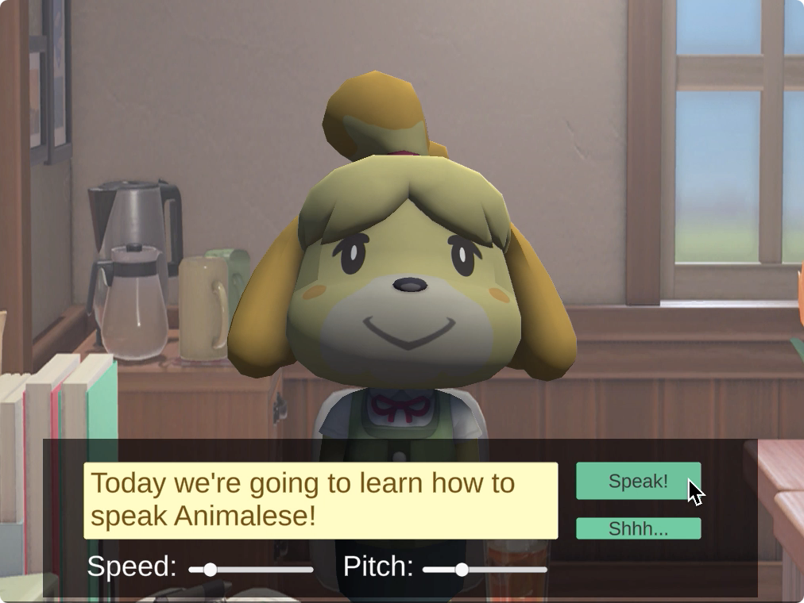

Animalese
========

This project provides an implementation of Animalese, the default language in the Animal Crossing games. It was originally created for the [2020 Game Audio LA Microtalks](https://www.twitch.tv/gameaudiola). 

## Getting Started
Open `Assets/Scenes/Animalese.unity` and press play!

You can directly control text, pitch, and speed in-game, as well as looping and the event parent path in-editor.

To adjust the event parent path, click on the Isabelle prefab and navigate to the Animalese Speaker script in the Inspector. You can then edit the "Event Parent Path" field.

Currently valid paths are:
- `event:/AnimaleseBase/` -- default Animalese approximation
- `event:/AlphabetSong/` -- all letters are sung according to the Alphabet Song
- `event:/PianoChromatic/` -- all letters are piano notes
- `event:/Drums/` -- all letters are drum hits

Feel free to add your own samples using the FMOD project (`Animalese_AudioStaging/Animalese_AudioStaging.fspro`) -- would love to see what you come up with!

## Dependencies
- Unity 2020.1.3f1 https://unity3d.com/get-unity/download/archive
- FMOD Studio 2.00.03 https://www.fmod.com/download